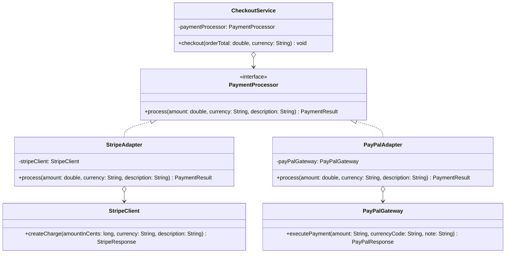

# Adapter Pattern — Payment Processor (Stripe & PayPal)

**Intent:** Convert the interface of a class into another interface that clients expect. Lets incompatible interfaces work together.

## UML

## Roles
| Class | Role |
|---|---|
| `PaymentProcessor` | Target interface — what our app expects |
| `StripeClient`, `PayPalGateway` | Adaptees — third-party SDKs we can't change |
| `StripeAdapter`, `PayPalAdapter` | Adapters — translate our interface to the SDK |
| `CheckoutService` | Client — only knows `PaymentProcessor` |
