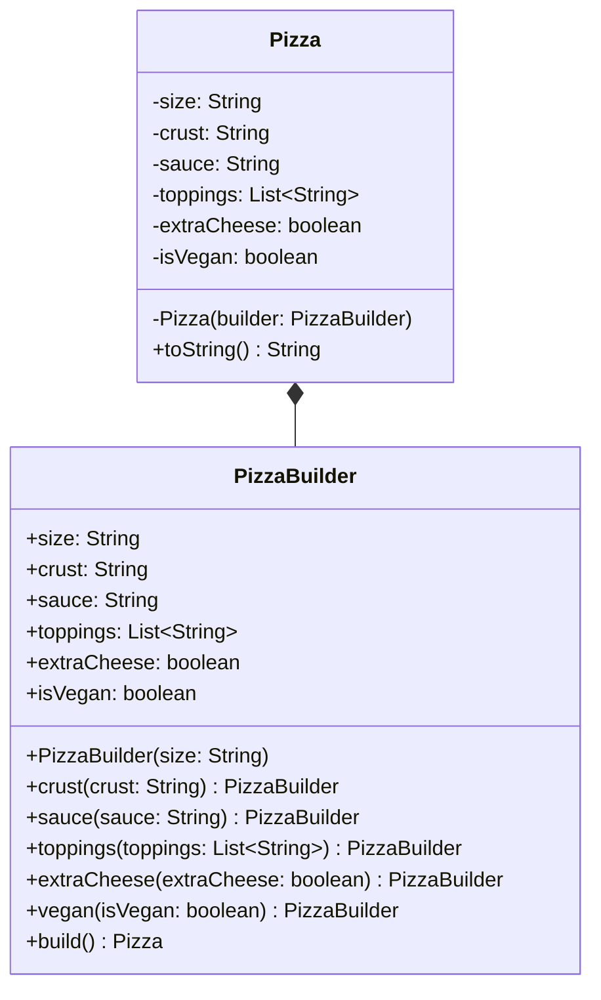

# Builder Pattern — Pizza Builder

**Intent:** Separate the construction of a complex object from its representation so the same construction process can create different representations.

## UML

## Roles
| Class | Role |
|---|---|
| `Pizza` | Product — immutable, private constructor |
| `PizzaBuilder` | Builder — fluent API, enforces required fields, calls `new Pizza(this)` |

## Why Builder here?
`Pizza` has 1 required field (`size`) and 5 optional ones. Without Builder this leads to telescoping constructors or mutable setters. Builder gives a readable, safe, immutable construction.
