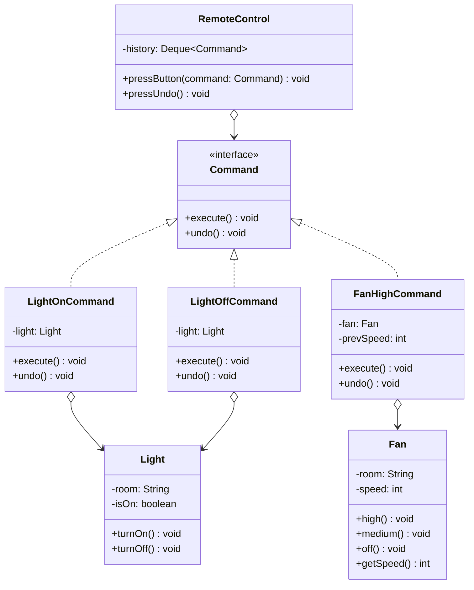

# Command Pattern — Smart Home Remote Control

**Intent:** Encapsulate a request as an object, letting you parameterise clients, queue requests, and support undoable operations.

## UML

## Roles
| Class | Role |
|---|---|
| `Command` | Command interface |
| `LightOnCommand`, `LightOffCommand`, `FanHighCommand` | Concrete commands |
| `Light`, `Fan` | Receivers — perform the actual work |
| `RemoteControl` | Invoker — triggers commands, maintains undo history |
