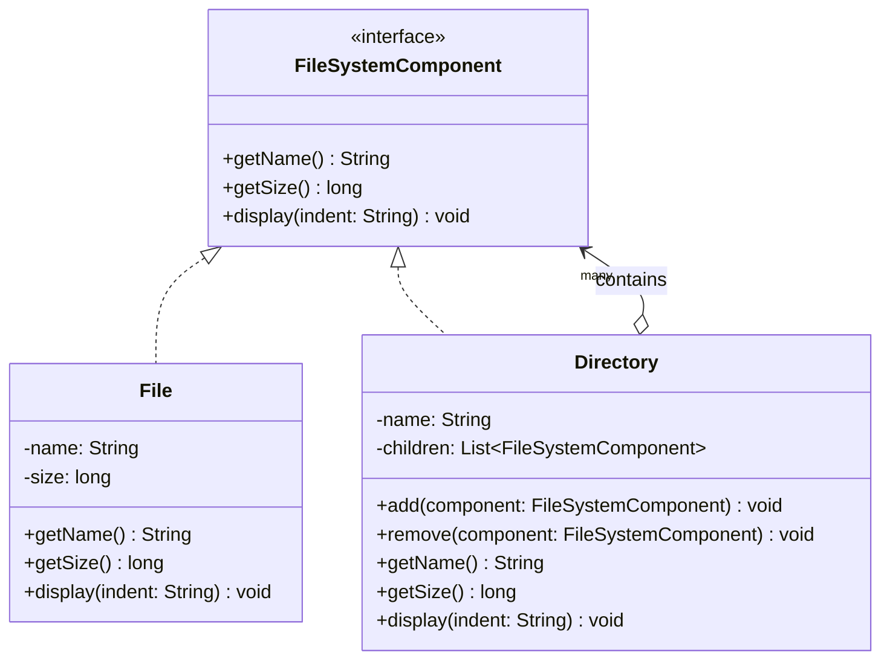

# Composite Pattern — File System

**Intent:** Compose objects into tree structures to represent part-whole hierarchies. Lets clients treat individual objects and compositions uniformly.

## UML

## Roles
| Class | Role |
|---|---|
| `FileSystemComponent` | Component — uniform interface for leaf and composite |
| `File` | Leaf — no children, holds actual size |
| `Directory` | Composite — holds children, delegates `getSize()` recursively |
