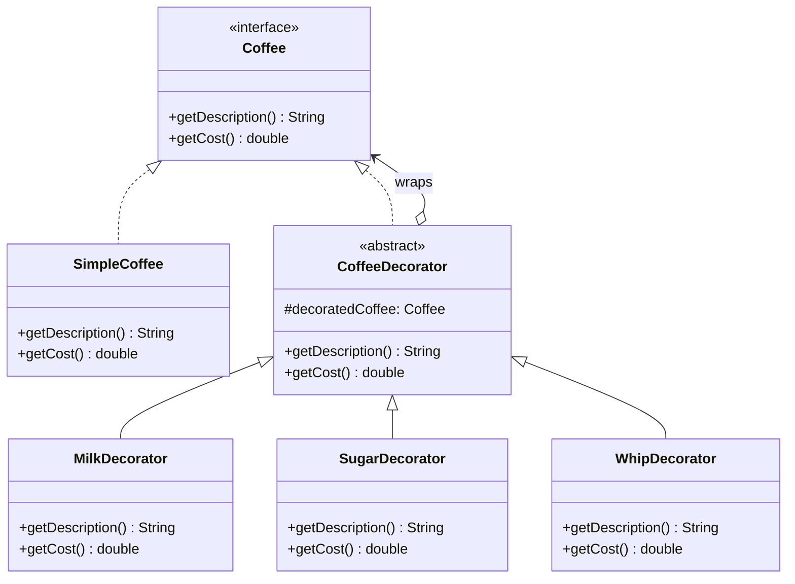

# Decorator Pattern — Coffee Shop

**Intent:** Attach additional responsibilities to an object dynamically. Provides a flexible alternative to subclassing for extending functionality.

## UML

## Roles
| Class | Role |
|---|---|
| `Coffee` | Component interface |
| `SimpleCoffee` | Concrete component (base object) |
| `CoffeeDecorator` | Abstract decorator — wraps a `Coffee` |
| `MilkDecorator`, `SugarDecorator`, `WhipDecorator` | Concrete decorators — add cost and description |
