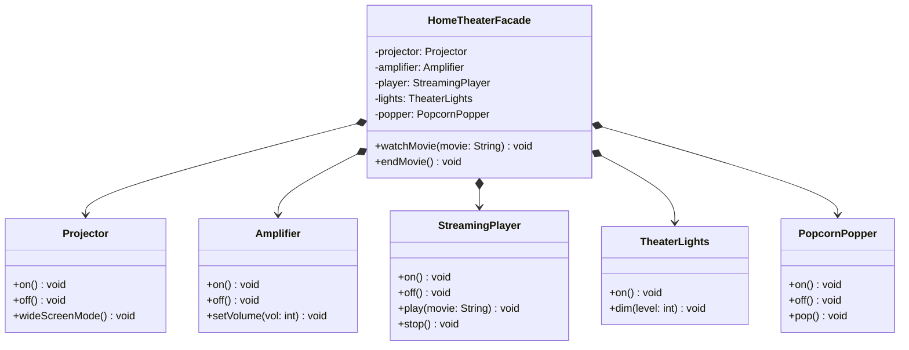

# Facade Pattern — Home Theater System

**Intent:** Provide a unified, simplified interface to a complex subsystem.

## UML

## Roles
| Class | Role |
|---|---|
| `HomeTheaterFacade` | Facade — exposes `watchMovie()` / `endMovie()` hiding 10+ subsystem calls |
| `Projector`, `Amplifier`, `StreamingPlayer`, `TheaterLights`, `PopcornPopper` | Subsystem classes |
