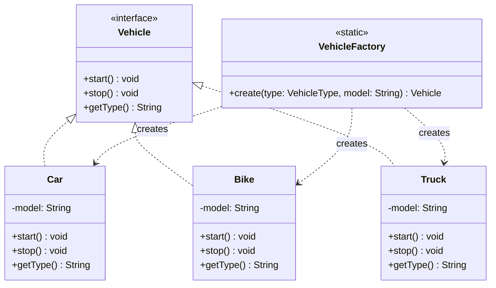

# Factory Pattern — Vehicle Factory

**Intent:** Define an interface for creating objects, letting the factory decide which class to instantiate. Clients depend only on the interface.

## UML

## Roles
| Class | Role |
|---|---|
| `Vehicle` | Product interface |
| `Car`, `Bike`, `Truck` | Concrete products |
| `VehicleFactory` | Factory — centralises object creation |
