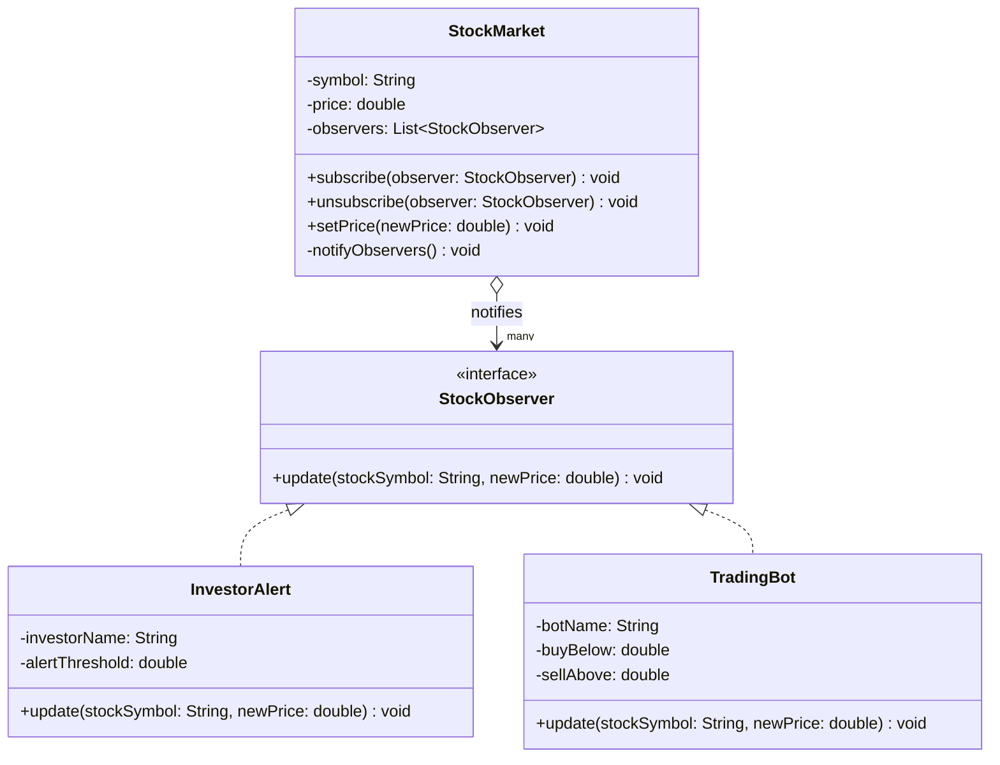

# Observer Pattern — Stock Price Notification

**Intent:** Define a one-to-many dependency so that when one object changes state, all dependents are notified automatically.

## UML

## Roles
| Class | Role |
|---|---|
| `StockObserver` | Observer interface |
| `InvestorAlert`, `TradingBot` | Concrete observers |
| `StockMarket` | Subject (Observable) — maintains and notifies observer list |
