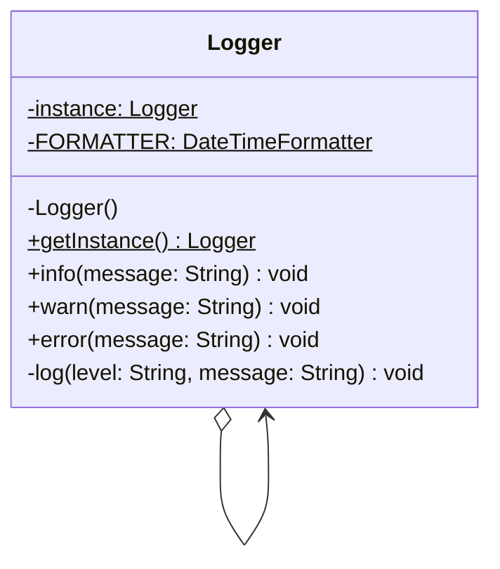

# Singleton Pattern — Application Logger

**Intent:** Ensure a class has only one instance and provide a global point of access to it.

## UML

## Roles
| Class | Role |
|---|---|
| `Logger` | Singleton — private constructor, static `getInstance()`, lazy + thread-safe via double-checked locking |

## Thread Safety
Uses **double-checked locking** with `volatile` to ensure exactly one instance is created even under concurrent access.
