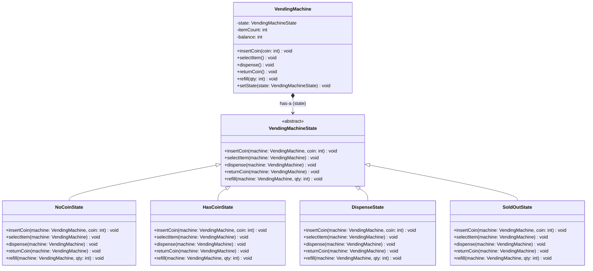

# State Pattern — Vending Machine

**Intent:** Allow an object to alter its behaviour when its internal state changes. The object will appear to change its class.

## UML



## State Transitions

```
[NoCoinState] --insertCoin()--> [HasCoinState] --selectItem()--> [DispenseState] --dispense()--> [NoCoinState]
                                     |                                                                  |
                                returnCoin()                                               itemCount==0 |
                                     |                                                                  ▼
                                [NoCoinState]                                              [SoldOutState]
                                                                                                |
                                                                                            refill()
                                                                                                |
                                                                                           [NoCoinState]
```

## Roles
| Class | Role |
|---|---|
| `VendingMachineState` | Abstract state — defines all operations; `machine` passed as parameter so states need no back-reference |
| `NoCoinState` | Waiting for coin |
| `HasCoinState` | Coin inserted, waiting for item selection |
| `DispenseState` | Dispensing item |
| `SoldOutState` | No items left |
| `VendingMachine` | Context — delegates all calls to current state, passing `this` |
