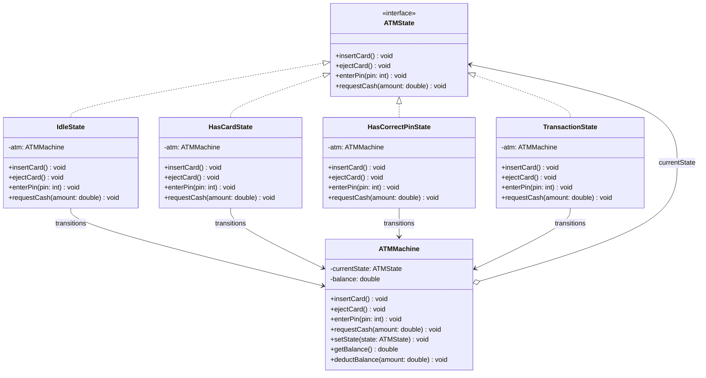

# State Pattern — ATM Machine

**Intent:** Allow an object to alter its behaviour when its internal state changes. The object will appear to change its class.

## UML



## State Transitions

```
[Idle] --insertCard()--> [HasCard] --enterPin(correct)--> [HasCorrectPin] --requestCash()--> [Transaction] --done--> [Idle]
         |                   |
         |            enterPin(wrong)
         |                   ↓
         |                [Idle]
         +--ejectCard()-->[Idle]
```

## Roles
| Class | Role |
|---|---|
| `ATMState` | State interface |
| `IdleState`, `HasCardState`, `HasCorrectPinState`, `TransactionState` | Concrete states |
| `ATMMachine` | Context — delegates all operations to current state |
