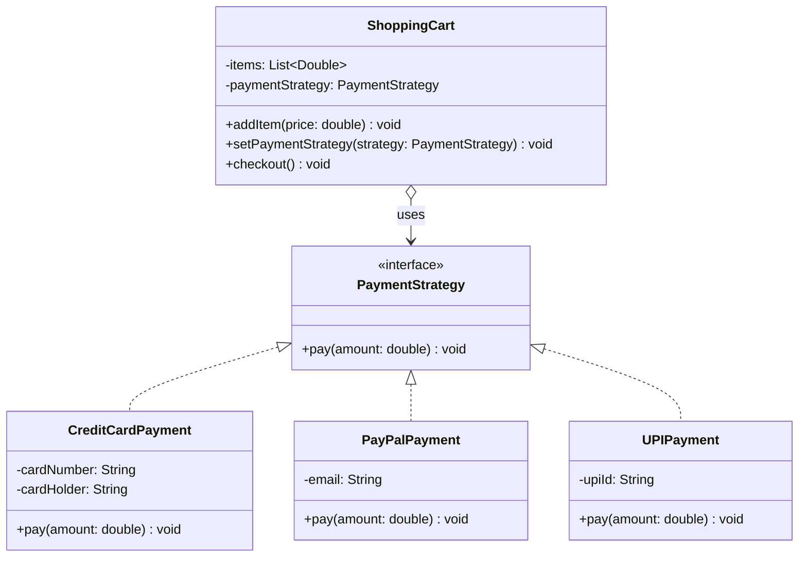

# Strategy Pattern — Payment Processing

**Intent:** Define a family of algorithms, encapsulate each one, and make them interchangeable at runtime.

## UML

## Roles
| Class | Role |
|---|---|
| `PaymentStrategy` | Strategy interface |
| `CreditCardPayment`, `PayPalPayment`, `UPIPayment` | Concrete strategies |
| `ShoppingCart` | Context — delegates payment to the strategy |
